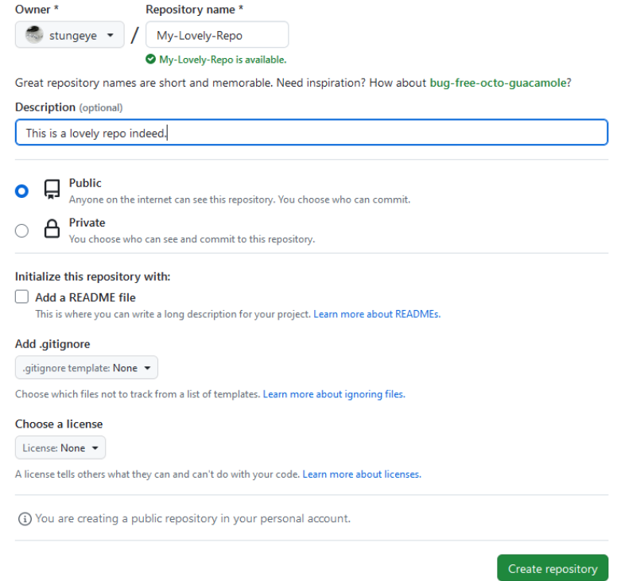

<!-- prettier-ignore-start -->
# Remote Repos
{: .no_toc }

Remote repositories are a version of your project that is hosted on a remote server. 
Remote repositories can interact with local repositories, allowing you to push your changes to others and pull their changes to your local repository.

## Table of Contents
{: .no_toc }

1. TOC
{:toc}

<!-- prettier-ignore-end -->
## Adding / Configuring a GitHub Remote

To save a local git repository to your GitHub account, create a new repository by way of the "+" button in the top right corner of the GitHub website.
**Important:** Be sure not to initalize with a README or with any other files.

## Pushing and Pulling
When you want to push the latest state of your repo to GitHub:
`git push origin <branch-name>`

When you want to grab the latest commits from GitHub:
`git pull origin <branch-name>`

## Remote Auth with SSH Keys
Generate a public/private key pair from the Git Bash terminal:
`ssh-keygen -t ed25519 -C "your_email@example.com"` _ed25519 is an algorithm used to generate an SSH key._
Press Enter to accept the default save path, and make note of this path.
It's good practice to secure your keys with a passphrase. Just don't forget it.
Navigate to the save path, open the `id_ed25519.pub` file and [copy-paste it's contents here.](https://github.com/settings/ssh/new)
Test from the terminal: `ssh -T git@github.com` (Type `yes` when prompted.)

## Additional Resources
[Creating a Remote Repository with Git](https://docs.github.com/en/get-started/getting-started-with-git/managing-remote-repositories)
[Push to a remote repository](https://docs.github.com/en/get-started/using-git/pushing-commits-to-a-remote-repository)
[Pull changes from a remote repository](https://docs.github.com/en/get-started/using-git/getting-changes-from-a-remote-repository#pulling-changes-from-a-remote-repository)
[SSH Keys](https://docs.github.com/en/authentication/connecting-to-github-with-ssh/generating-a-new-ssh-key-and-adding-it-to-the-ssh-agent)

