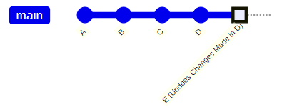
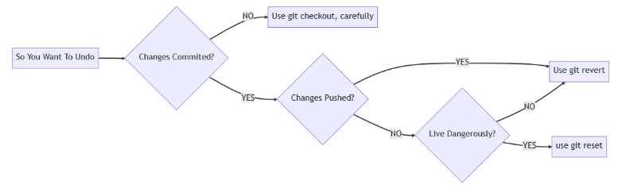

<!-- prettier-ignore-start -->
# Undoing in Git
{: .no_toc }

With Git we can undo almost anything. There are three ways we can undo in git, `checkout`,`reset`, and `revert`.

## Table of Contents
{: .no_toc }

1. TOC
{:toc}

<!-- prettier-ignore-end -->

## The Usual Three Ways of Undo:
- **Checkout** (Slightly Dangerous)
- **Reset** (Destructive)
- **Revert** (Safe)

## Checkout

### When to Undo with Checkout?

The simplest private undo. **Discard uncommitted local changes.**
```
git checkout <path-or-filename>
```
Works if:

- The changes you wish to undo haven't yet been committed. (Dirty files.)
- You wish to revert to the most recently committed version of a file or files.

### Undoing with Checkout

Let's say you made a bunch of changes to your `readme.md` that you now regret.

If you haven't committed these changes, you can undo them like this:
```
git checkout readme.md
```
If you want to revert all folders and files to the most recent commit:
```
git checkout .
```
_**WARNING:** Slightly dangerous. The discarded changes cannot be recovered!_

## Reset

### When to Undo with Reset?

Use `git reset` to undo one or more commits in our local repository.

_**WARNING:** Dangerous. The rewrites history by changing the HEAD pointer._

A `git reset` comes in two main flavors:

- Hard Reset (Dangerous)
- Soft Reset (Weird)

### Hard Reset

Changes your working directory to match a specific commit.
```
git reset --hard [commit id]
```
_**WARNING:** Uncommitted changes lost. All files are reset to the specified commit!_

### Soft Reset

Keeps your changes in the working directory, but still resets the HEAD.
```
git reset --soft [commit id]
```
_**WEIRD:** HEAD and your working directory may differ if you had uncommited changes._

#### Before Reset: HEAD at D


Let's say we want to undo the changes made in C and D:
```
git reset --hard B
```

#### After Reset HEAD at B


#### No Commits Were Lost
```
git reset --hard D
```
#### Back to Where we Started


## Revert

### When to Use Revert?

Use `git revert` to run a specific commit **in reverse.**

Typically used to undo a commit that has been shared with others.

_The public undo - it says, 'I made a mistake, but I want to keep a record of it.'_

### Reverting Commits

```
git revert <commit id>
```
Creates a new commit that undoes changes from the specified commit.

**The Safest Undo Choice!**
Reverting maintains history, making it a **safe choice** for:
- Undoing local commits.
- Undoing commits pushed to a remote repo.

#### Before Revert: HEAD at D


If we wish to revert the changes made in D:
```
git revert D
```

#### After Revert: HEAD at E



### Reverting Multiple Commits

The `git revert` command reverts a single commit by default.

We can run it mutiple times to revert multiple commits:
```
git revert D
git revert C
```
Or we can revert a sequence of commits: *(Each commit is reverted separately!)*

```
git revert C^..D
```
If you only want a single revert commit: *(The -n stands for "no commit".)*
```
git revert -n C^..D
git commit -m "Revert commits C through D inclusively."
```

## Undo: A Decision Tree



## Additional Resources

[Undoing Things Documentation](https://git-scm.com/book/en/v2/Git-Basics-Undoing-Things)

[Git Checkout](https://www.atlassian.com/git/tutorials/using-branches/git-checkout)

[Git Revert](https://www.atlassian.com/git/tutorials/undoing-changes/git-revert)

[Git Reset](https://www.atlassian.com/git/tutorials/undoing-changes/git-reset)
